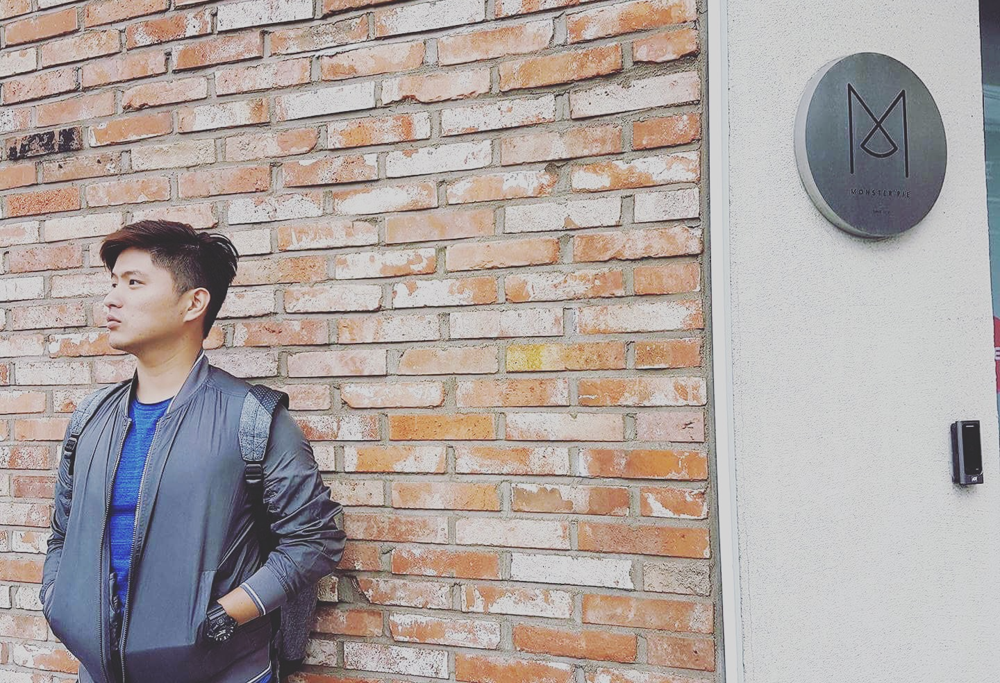

I'm a programmer/software engineer/full stack developer, whatever you call it, mostly based in Selangor, Malaysia. I'm currently assuming the role of CTO in [Taessina PLT](http://www.taessina.com), where we architect and build solutions.

Outside of work, I'm an amateur basketball player, casual gamer, backpacker. I've been trying to leave the country once every few months to be a digital nomad. Coding and reading from a café are my norm.

I like to mentor/to coach, which enables me to reassert my capabilities. Self-improvement books are my favourite, as I believe one should always continuously improve oneself. Never stay too long in your comfort zone.

Check out my social media below to get in contact with me.

Yb out.
