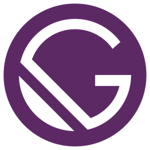
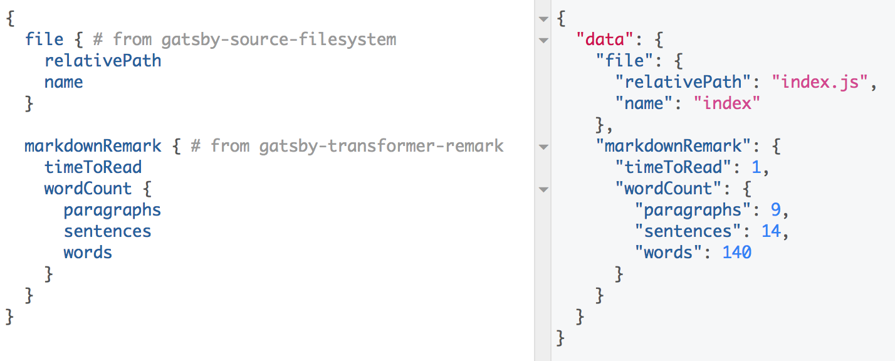

> This is part of a series of Gatsby posts focusing on what I've learnt while setting up this blog, [see other related posts in the series here](/categories/Getting%20into%20Gatsby).

There seems to be a trend where blogs built with [Gatsby](https://www.gatsbyjs.org) must have a post written about it.



I will be starting a series of _Gatsby tutorials_, but to document _gotcha_ moments that I faced while trying to set this blog up. Mainly because the documentation wasn't completely beginner proof, [see the pain points faced by other developers](https://www.gatsbyjs.org/blog/2017-12-20-introducing-the-gatsby-ux-research-program/#what-are-the-top-10-pain-points-of-gatsby-users).

## Choosing a starter
This is really a pain point for me, I have been trying to get my blog set up since Nov 2017. But many times I was defeated by the starters available. To no avail have I found a starter that I have been looking for, there goes all my time spent choosing the ideal starter. _Okay, maybe just ranting over my inner imperfect perfectionist._

The available options are either too complex, too simple, poor layout or unaesthetic theme. Or perhaps, I just don't like the default eslint used by Gatsby _(why template literals everywhere?)_.

I ended up with the blog [starter](https://github.com/gatsbyjs/gatsby-starter-blog) provided by Gatsby themselves, then work my way from there. If you'd take a look at the [source codes](https://github.com/alvinthen/yaobin.me/tree/b707d3c788371beec3f0d87c44cc60cb331b9db9) of this site, I don't even know how to describe it, it's just not up to my standard.

`// TODO: Clean up the mess`

#### Lesson learnt
Screw all advanced starters (yes, of course they'd help if they're opinionated, but then again, whose opinions should we value?).

Experiment around with any of the basic starters, get familiar, understand these terms `layout`, `template`, how to use `graphql` in `components`, what's `gatsby-node.js` all about.

Here's what I thought you should know after completing any Gatsby tutorials.

### Start with the basic starter
Any starter will do, use the basic one, in most cases, the starters available will not fit your UI requirements. I'd recommend to start fresh and look into the structure.

### Project structure
```
.
├── gatsby-config.js
├── gatsby-node.js
└── src
    ├── components
    ├── layouts
    ├── pages
    ├── styles
    └── templates
```

The tree above is truncated to show the most important files.

#### `gatsby-config.js`
```javascript
// What you will need at minimum to generate pages from Markdown files.
module.exports = {
  plugins: [
    'gatsby-source-filesystem',
    'gatsby-transformer-remark'
  ],
};
```

This is where you should configure the plugins you use. These plugins help to transform your data into HTML pages. There are 2 types of plugins.

* **Source(r?)** - which transforms your source of data into [Nodes](https://www.gatsbyjs.org/docs/node-interface/). Often than not, you will use `gatsby-source-filesystem` if your source of data is in the form of Markdown files.

* **Transformer** - which further transforms nodes created by source plugin into new nodes. E.g. after transforming your Markdown files into `File` nodes, `gatsby-transformer-remark` transforms those nodes into meaningful data so that you can use them in your React component.

A GraphQL schema is then created based on the nodes after running all the plugins, available for your React components via GraphQL queries.

Gatsby comes with GraphiQL for you to test your queries. You can access it via http://localhost:8000/___graphql after running `gatsby develop`.

Here's what it looks like after the plugins read your Markdowns and transformed them.



That's basically what `gatsby-config` is for, declare your plugins, Gatsby then creates all the nodes as instructed by the plugins, based on those nodes, generate a GraphQL schema which you can use in your React components.

Next up: `gatsby-node`, until then.
