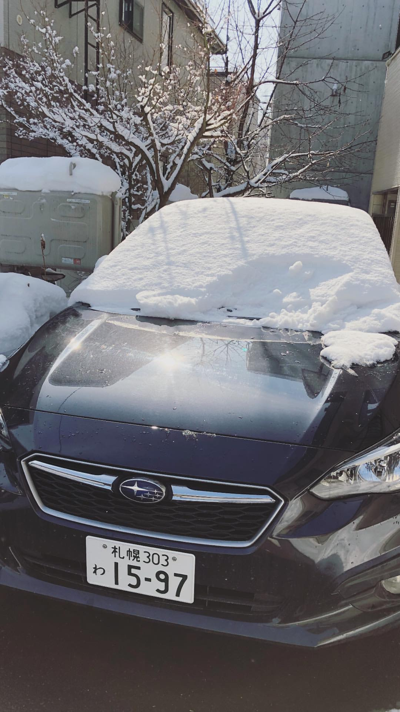
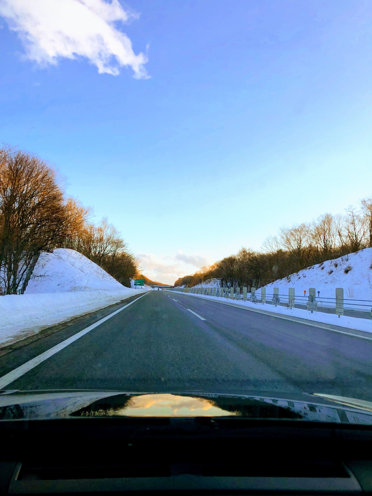

# Cruising in Sapporo-shi with snow everywhere
Driving in the city is quite relaxing, even during the nighttime, it's nicely litted. However, be careful that the leftmost lane may be partially/fully blocked by snow, leaving you not much space to navigate.

Some of the roads, mainly in housing areas, are mostly covered in snow, it could be slippery.

### TL;DR
* 30-60 km/h in major roads
* 80-100 km/h in highways
* Use snow tires
* Snowing makes visibility real low
* Beware of slippery frozen/snow-covered roads

## Speed limit in the city area is 30-60 km/h
From my understanding, if it's not stated, the speed limit is 60 km/h, otherwise follow the signboard. Although the local doesn't seem to adhere to this rule. Before reaching Hokkaido, I have been told that traffic enforcement in Japan is very strict but it's not as what I have seen. Most of the time they're at least 20 km/h faster than the limit. It actually feels awkward adhering to the limit as I was building up a crawl behind me, especially when it's a single lane road.

Driving back and forth to the lakes in Chitose is real slow, 30-50 km/h all the way for almost two hours. But if you're driving in the night, and when it's snowing, then speed limit makes sense. The visibility is real low when it snows at night.

`youtube:https://www.youtube.com/embed/M4TkdRKsL-w`

## Speed limit in the highway is 80-100 km/h
Same as the above, if it's not stated, the limit is 100 km/h. Again, whenever I'm driving at the speed limit, it makes me uncomfortable causing traffic behind of me. Even trucks are overtaking me furiously.

I must admit, driving at the speed limit drives me nut, given the condition of the road and mostly only modern cars on the road, the speed limit should be increased.

In the end, I decided to follow the speed of the locals, it's smoother, and stopped me from drowsing.

`youtube:https://www.youtube.com/embed/KGLCnYNtoDk`

Driving in the night at the highway shouldn't be a problem, the roads are welly maintained, but may be frozen, thread carefully.

`youtube:https://www.youtube.com/embed/MPyluE8AKgs`

## Shoutout to [Subaru EyeSight](https://www.subaru.com/engineering/eyesight.html)
I really love this technology so much that I have to give it a shoutout! Throughout my drive in Hokkaido, 80% of the time my foot wasn't at the pedals. It features an adaptive cruise control, helping me to maintain the speed that I have set, while keep a distance (configurable!) with the car in front of me. It will come to a complete stop when the car in front of me stops fully, and with a nudge on the throttle, it will continue cruising up to the speed that I have set.

The Subaru Impreza also comes with a lane assit function which will alert me if I'm straying out of lane, and even adjusts itself back to the lane. While it's like self-driving, it requires you to hold onto the wheel.

Nonetheless, I truly enjoy driving in Hokkaido, with the beautiful scenery, and also my newly-favourite Impreza 😆.

