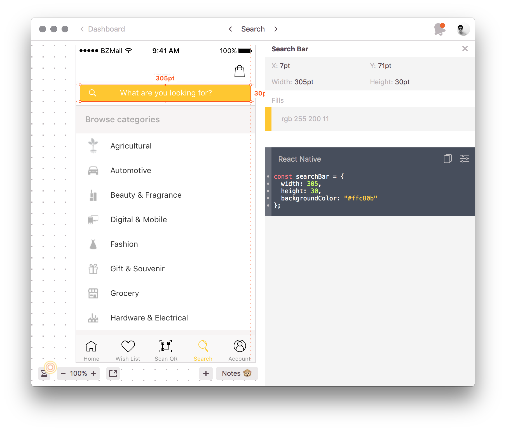

# Do you need a UI framework?
To answer this question, here's several considerations that you should take into account before making your decision.

1. Are you building a one-off project or a seemingly long-lasting product?
1. Do you have a design to follow? Does the design come with styleguide?
1. Web or native? (to us, React or React Native)

# TL;DR
**Use UI framework** if you can customize its theme easily, as per your team's experience and capability.

**Handcraft** if your team is better at it, and have more lenient timeline.

## Short-term vs long-term project
If you're building a long-term project/product, you can start building with a UI framework first. I assume you're going to build an MVP first, starting with a UI framework shortens time to market. As your product matures, that's when rebranding will happen, you are most likely to be hiring a designer. Have your designer build a styleguide, or a custom theme around the UI framework that you have been using.

What if your designer is not literate with the UI framework that you are using? Have your frontend engineer work with her. What we would have done is build components with our designers, and then slowly migrate the existing UI to use the newly built custom UI framework. This process will take longer time, but will benefit most on the long run, especially on grooming our new employees. At our company, we're always striving to nurture newcomers, give them chances to learn new things, experience it on the hard way before making the shortcuts.

As for short-term projects, go with a UI framework too, as building custom components is not an easy task, especially if you're going to support multiple screen sizes or browsers. If the project is part of a longer-term project, maybe you are building for a campaign, then just rely on the existing framework/styleguide.

## Hiring a designer?
What kind of designer are you hiring? A full-fledged designer with knowledge on customizing UI frameworks or a beginner/intermediate level designer that only designs? I'm pretty sure the answer is quite straightforward whether or not to use a UI framework. But if you're hiring the latter one, have your team use a collaboration tool for designs (we're using [Zeplin](https://zeplin.io/)). This will increase your team's productivity, most of the styling are given in CSS (or something alike).

_Zeplin providing the styling information with React Native extension_

We have designers that favored [Material Design](https://material.io/), which we will almost by default use [Material Components Web](https://github.com/material-components/material-components-web) for it. That's for web though, as for React Native, we have yet to find a promising one, mostly are half baked or not maintained anymore. This is part of the reason why we prefered to build our own components on React Native, read below.

## Web or native?
Anyone that has work with the web knows how annoying it is to support multiple browsers, for this case, I would almost always prefer to use a framework than handcrafting it. There are exceptions whereby I will prefer handcrafting it. These mostly happen when the designs cannot be easily built with any existing framework. If you are going to handcraft your CSS, start with mobile size first, then slowly extend to desktop sizes. With Flexbox and Grid layouts support in most major browsers, it's easier to support multi screen size nowadays. Except when your client specifically wanted to support older IEs, this is when headache happens. We would mostly advice our clients to move to modern browsers as they also bring better security. Otherwise, we'll fallback to hacky methods.

On native part, we almost by default handcraft the UI components. It's always better, but a little bit tricky to support multiple screen sizes. Otherwise, it's pretty straightforward on React Native. In our experience, using UI frameworks restricted our design and always had trouble customizing the components. It always lead us back to the question, customize the framework and be left behind of future updates, or redesign so that we use purely components provided by the framework.

In future posts, I will share on scaling React Native components to support multiple screen sizes, and also my progress on refactoring this site into proper React components, so stay tuned!

(Should I implement RSS? Let me know down below!)
