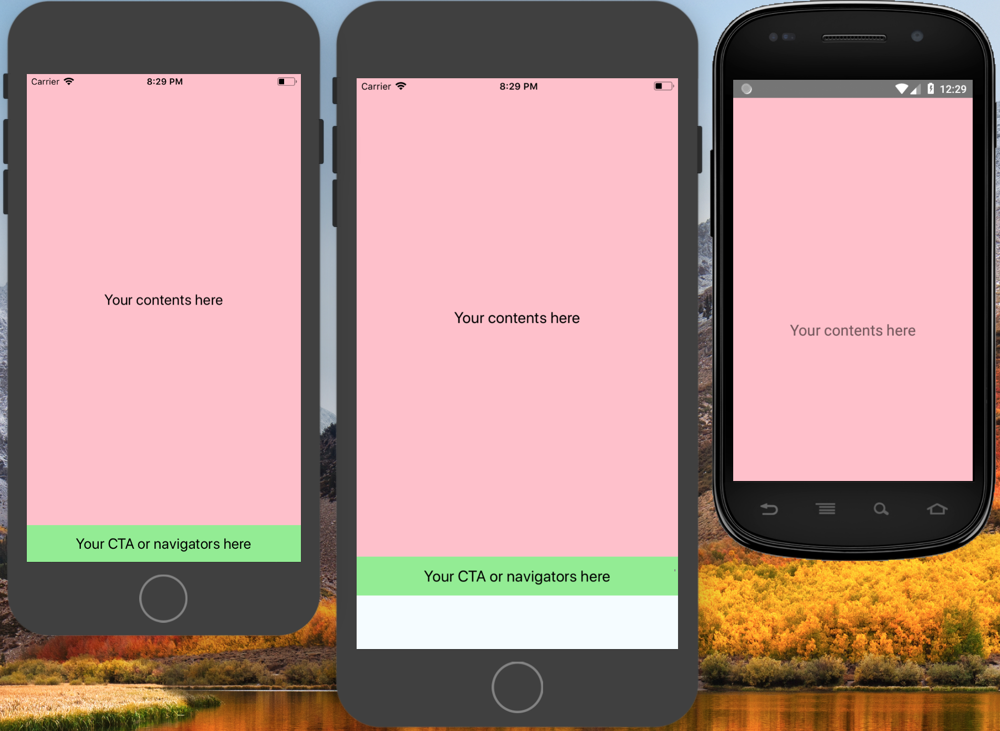
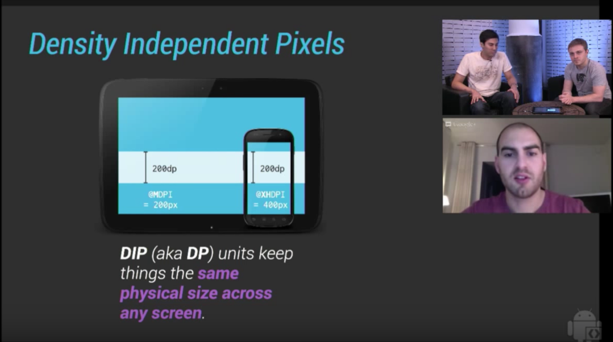
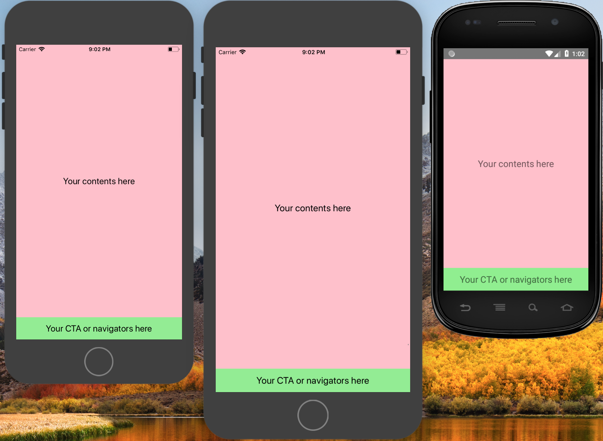
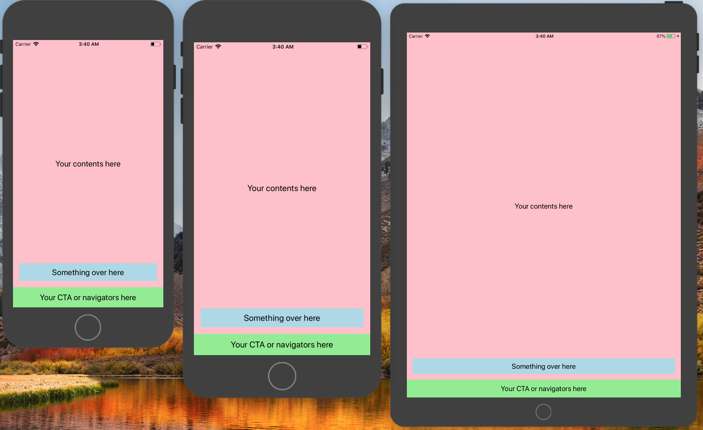
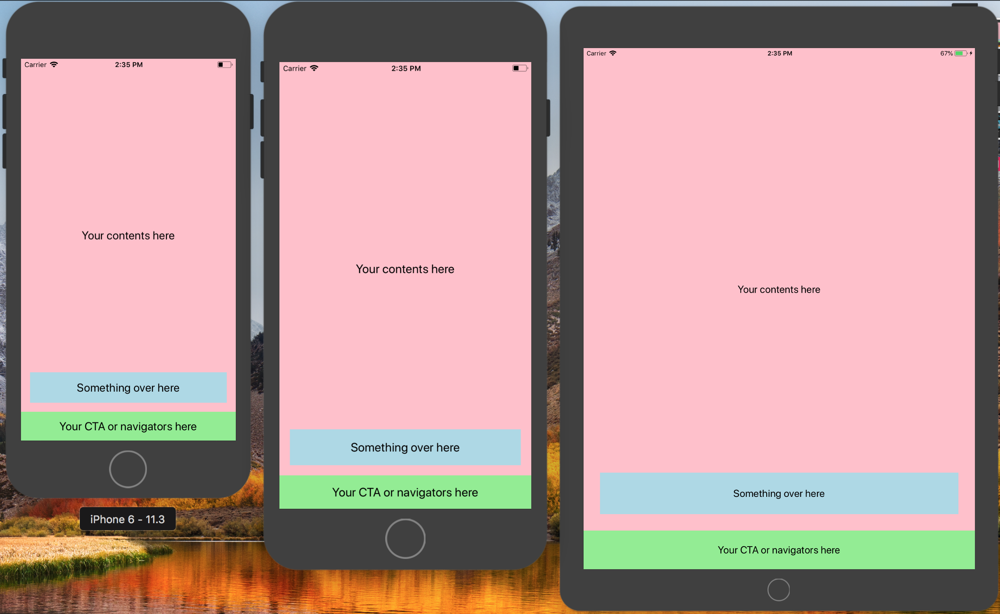

# TL;DR or rule of thumb
1. Use flexbox (or percentage unit on RN >= 0.43) to fill up spaces.
1. Use dp if you want the component to have exact physical size across all devices.
1. If you must use dp but your component looks too small on a higher dpi device, or too large on a smaller dpi device, use [react-native-size-matters](https://github.com/nirsky/react-native-size-matters) to scale.


# Supporting multiple screen sizes in React Native
Admit it, you tried implementing a design only on a device, which most likely is the default iPhone 6 simulator on your Mac, since it's the default simulator opened via `react-native run-ios`, and you rarely run it on Android (Ok, maybe not for those that aren't using Mac) because iOS simulator's performance is just outstanding.

Then, you tried to run that app on a different device, maybe on a larger iPhone, or a smaller dpi (dots per inch, or ppi - pixels per inch) Android emulator, or a real device, and things start to go out of way.

Maybe you get results like this.



The leftmost is the device you used for development, the middle one is on a larger dpi, with an extra space at the bottom. The rightmost is a smaller dpi device with the bottom section cropped.

The culprit is most likely because you're specifying the heights using hardcoded values in dp, or maybe you're just following the dimensions that your designer gave you.

### In case you wonder how designer works
In short, they always start drawing their UI with a template provided by their tools, which is most likely `375 x 667`, the logical resolution of an iPhone 6. And then they will provide you with the dimensions using some collaboration tools (In a [previous post](/blog/do-you-need-a-ui-framework), we introduced Zeplin).

If you proceed to use these numbers provided, you will much likely ended up with a result shown above.

Below is the code that generated the mess.

```jsx
export default () => (
  <View style={styles.container}>
    <View style={styles.box}>
      <Text style={styles.text}>
        Your contents here
      </Text>
    </View>
    <View style={styles.box2}>
      <Text style={styles.text}>
        Your CTA or navigators here
      </Text>
    </View>
  </View>
);

const styles = StyleSheet.create({
  container: {
    flex: 1,
    backgroundColor: '#F5FCFF',
  },
  box: {
    justifyContent: 'center',
    alignItems: 'center',
    backgroundColor: 'pink',
    height: 619,
    width: '100%',
  },
  box2: {
    justifyContent: 'center',
    alignItems: 'center',
    backgroundColor: 'lightgreen',
    height: 48,
    width: '100%',
  },
  text: {
    fontSize: 20,
    textAlign: 'center',
    margin: 10,
  },
});
```

### Before anything else
We need to understand that dimensions in React Native is actually using dp (Density-independent Pixels (aka dip), or Logical Points in iOS). So, a `height: 48` (_that's the default height for a Material Design button_) will render **48 density-indenpendent pixels, approximately 7mm** regardless of what devices you're running on.



This is a screenshot from [this video](https://www.youtube.com/watch?v=pBKGbCu0pJg&t=1235s) that has helped me to strengthen my knowledge on dp.

For me, it's helpful to remember that **using density-independent pixels does not mean you do not need to scale your UI**. After all, every phone has a different dp resolution. For example, it's `375 x 667` on an iPhone 6, and `414 x 736` on an iPhone 6 Plus. This is why the above problem exists. We can't rely on dp to fill up spaces, there's a better way for it.

# Flexbox all the way!
Flexbox for the rescue! Instead of specifying a height for your _stretchable_ content, give it a `flex: 1`. Here's what you'll get.



Simple and easy, isn't it?

Flexbox is great in organizing your components, positioning them, and filling up spaces with your _stretchable_ components. It's also particularly useful when your UI is mostly built on a ratio. Speaking of ratio, there's several ways to achieve the same result.

```js
import { Dimensions, StyleSheet } from 'react-native';

const usingFlex = StyleSheet.create({
  box1: { flex: 1 },
  box2: { flex: 2 },
});

const usingPercentage = StyleSheet.create({
  box1: { height: '33.33%' },
  box2: { height: '66.67%' },
});

const { height } = Dimensions.get('window');
const usingViewports = StyleSheet.create({
  box1: { height: height / 3 },
  box2: { height: (height / 3) * 2 },
});
```

All the methods above will have the same outcome.

# What if I really need to use dp, how do I scale it?
We know, we've been through that too, sometimes you just need to follow the design provided exactly, pixel by pixel, while supporting multiple screen size. Below is most likely what you had.

_Note: this part onwards, it's more for aesthetic purposes than practical usage._



Notice that on the iPad, the two boxes of the bottom part look much more smaller on a bigger screen. Both of them are at 48dp which is roughly 7mm on the physical device. But, a 7mm box on a 240mm height is really tiny, this is why it appears relatively tiny on the iPad.

Here comes the solution, use [react-native-size-matters](https://github.com/nirsky/react-native-size-matters) for scaling. The [blog post](https://blog.solutotlv.com/size-matters/) has explained much on scaling, take a look over there!

And this is the result!



At [Taessina](http://taessina.com), we used `scale` and `verticalScale` for most of the dimensions, margins, paddings. While using  `moderateScale` specifying font sizes and line heights.

# To recap
1. Use `flex: 1` to fill up spaces.
1. `48dp === 7mm`.
1. `react-native-size-matters` to scale for aesthetic purposes.
