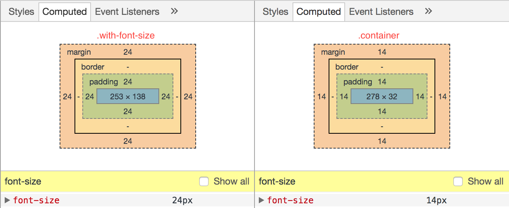

# EM or REM?

### TL;DR
* Use only `em` for `font-size`.
* Use `em` for `margin` or `padding` if it scales with `font-size`.
* Use `rem` for `margin` or `padding` otherwise.

# EM all the way for `font-size`!
`em` scales based on the closest `font-size`. By default, the `font-size` of the `html` element for browsers is **16px**. With this, let's see the below example on how `em` inherits the values.

<iframe height='400' scrolling='no' title='Effects of inheritance using EM' src='//codepen.io/alvinthen/embed/YLQQmz/?height=401&theme-id=light&default-tab=css,result&embed-version=2' frameborder='no' allowtransparency='true' allowfullscreen='true' style='width: 100%;'>See the Pen <a href='https://codepen.io/alvinthen/pen/YLQQmz/'>Effects of inheritance using EM</a> by Yao Bin (<a href='https://codepen.io/alvinthen'>@alvinthen</a>) on <a href='https://codepen.io'>CodePen</a>.
</iframe>

Two things to notice here.

1. The `
` element with **24px** has its `font-size` inherited from its parent which is **1.5em**. The `
` element with **36px** again has a `font-size` of **1.5em**, but this time its value is based off its parent's `font-size` which has already be computed as **24px**.

2. The `.container` element has its `margin` and `padding` set to `1em`. The image below shows the box model of the element. Notice that the `margin` and `padding` are computed as **24px** instead of 16px, due to the fact that `em` scales relatively to the closest `font-size`.

# When to use REM?
Now that we have understood the effects of inheritance using **em**, there will be situations where it backstabs you.

**rem** to the rescue! **rem** aka **R**oot **EM** calculated its value using the root `font-size` which is set at `html`, or 16px by default. This is useful when you don't want your sizes to be scale off the closest `font-size`.

Another situtation where I find `rem` useful is when I'm implementing Material Design. In MD, many of the keylines are in rhythm of **8dp**, which is **0.5rem** on default browser behaviour. I can easily add **0.5rem** to achieve the look and feel that I wanted (not that I can't do multiplies of 8 😝).

# To recite
* Use only **em** on `font-size`.
* If you want to scale with `font-size`, example, to increase spaces around a text when the `font-size` increases, use **em**.
* Use **rem** otherwise.
