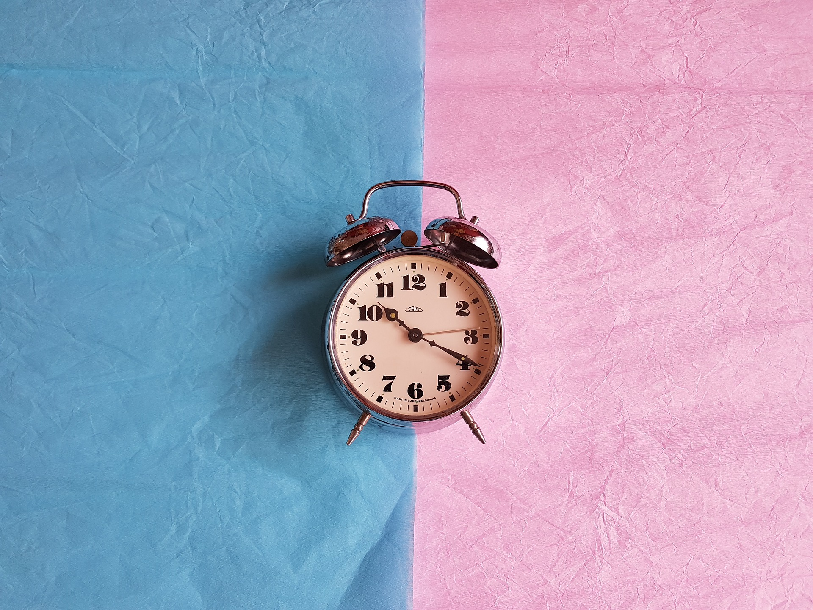

## TL;DR
You win the first hour of the day, you win the day.

**Pain now by disciplining yourself than carry the heavy load of regret.**

# This is a letter to myself
For months I have been procrastinating, spacing out, delaying my works over months. We're supposed to deliver a project by end of this month, yet the overall progress has been stuck at 50% for at least 2 months, consequently dragging down my teammates, and I need to employ them to deal with my leftovers. I have only one more week left. I put the blame on myself, for being unfocused, lazy, and undisciplined.

_Dear brain, seriously, stop wandering and stalling, sincerely YB._

# Self discipline is the center of all material success
Although the title is written for remote working, self discipline applies to everyone that wants to achieve something in their life. To help myself to get back on the track, I went looking for answers, and the ultimate answer I have gotten - self discipline.

# Self discipline is self love
Self discipline is telling yourself _"Yes, that pizza does look tasty and cheesy, but no, that slice is not going to make you any healthy. It's going to make you feel guilty as hell afterwards, and I love you so much that I don't want you to go through that feeling of being regretful. I love you so damn much that I'm going to stop you from eating that pizza." (Actually grabbing a bowl of granola right now.)_

> You can not win the war against the world if you can't win the war against your own mind.

Discipline is to forego immediate pleasure for the exchange of long term self respect. Something as simple as eating, it is not about your body as much as it is about your mind. Your mind is able to choose actions that are in your own best interest. Yet, everyday we are choosing shit that are not in our best interest.

> 99% of people are not willing to do what it takes to make their dreams come true.

Trying to lose weight? What's with that piece of cake on your plate and the soft drink on the side?

Unable to focus at work? Are you getting enough sleep? Why aren't you sleeping yet? Why are you still on Instagram looking for shit? Those pretty girls aren't going to be yours anyways.

> The marine has a saying, everybody wants to go to heaven but nobody wants to die at the same time.

# Self discipline is really important for remote working
Remote working gives you flexibility in working hours and freedom to choose where to work from. But _with great power comes great responsibility_. If you chose to abuse your freedom, it will haunt you back.

That's exactly what happened to me. I have the flexibility to choose what time I want to work, and freedom to work from abroad. But I chose to abuse my freedom, in the end, I got this bad habit of sleeping late and waking up late, consistently feeling lethargic and unfocused throughout the day. Not to mention procrastination, costing me my precious time, working less hours than what I should, ending up with consecutive midnight oils making up for lost time, it's a vicious cycle.

# Self discipline is not self punishment

Have you ever been in feared of disciplinary teacher in your high school? When most of us heard the word discipline, it is always linked to punishment. It always has this negative vibe around it, but discipline is, no doubt, the road to sustained happiness. If we're going to live a lazy undisciplined life, giving in to our feelings and act on these emotional impulses, we're going to make very poor choices that we regret later on.

If you have to choose between the pain of discipline and heavy load of regret, what would you choose?

> The world is attacking you, the world wants to fight you, the world's trying to hold you down. So you won't kick yourself in the balls? So you will stop yourself from getting what you dream?

Tonnes of distractions out there, are you willing to minimize these distractions and get to what you should be doing? Are you willing to go offline, reduce your time spent on social media? Cutting out negative sources?

If you want to transcend, are you setting up your environment to win?

Want to lose weight? Remove those junk food, put them out of sight, or better yet, bring in healthier alternatives.

Want to focus on your work? Turn your phone upside down, turn off notifications, reduce digital noises surrounding you. Block your time away from distractions, adopt the [Pomodoro](https://en.wikipedia.org/wiki/Pomodoro_Technique) technique. Your clients are your source of distractions? Train them. What's your excuse? Do you love them more than yourself that you are willing to give up your principles?

> Whatever you're trying to achieve in life, the critical component is getting things done in a systematic way. Building the character that's associated to getting things done in a systematic way requires you to be disciplined.

Every morning you have two choices: Continue to sleep with your dreams, or wake up and chase them. Put routines in the first hour of the day and in the last hour of the day.

Stop all your excuses. Our Prime Minister, Dr. Mahathir is still working relentlessly at the age of 93, what's your excuse?

You deserve better, way better. Don't let laziness slow you down. Now go and make me proud.

_Finally I can concentrate on my work._

[Credits](https://www.youtube.com/watch?v=n6sTlukHLiA)
