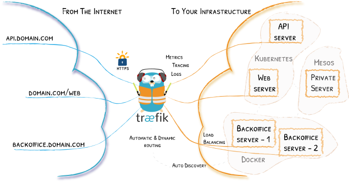
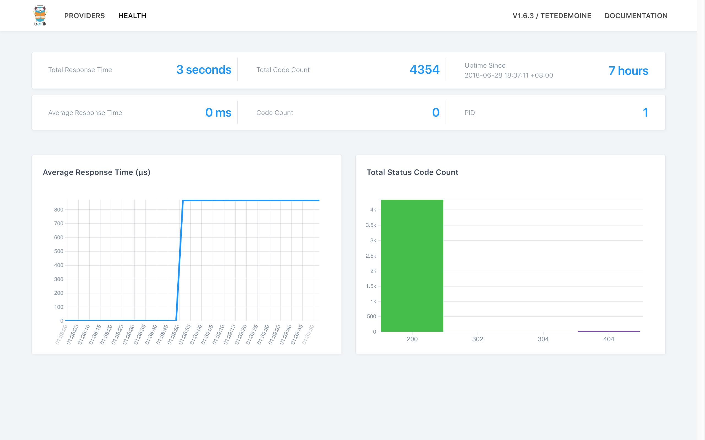

It's a very much delayed post, I blame it to rushing projects and trying to get 100% in God of War, which also leads me to studying Greek and Norse myths for several nights 🤷🏽‍♂️.


_Enough, boy._

# A little bit of preface
So you have done developing your app server and ready to deploy it into the wild. Surely you will need a publicly accessible hostname or public IP. You embark on a journey looking for hosting.

There are several of options:

1. CDN, if your app server is just generating static things, and don't need any persistence. Feasible, but rarely your choice.
1. PaaS, Platform as a Service, which your provider will maintain the infrastructure for you (DB, actual server running your instance, DNS, security updates, etc).
1. VPS, Virtual Private Server, where you own an instance of an OS of your choice, somewhere in the cloud. You maintain the OS, they maintain the physical server for you.
1. Serverless, this thing is a trend, and usually provided by an IaaS (Infrastructure as a Service), more than often associated with AWS Lambda. Not going into detail since we're talking about reverse proxy in this episode.

#### PaaS
If you have chosen PaaS, I congrats you, it's the simplest method. Imagine a simple `git push heroku master` deploys your entire app to Heroku without you doing anything (Okay, that may be exaggerating, but on a simple app, it does work magically, especially with Ruby on Rails).

Of course it does come with a price. Nothing worthy comes free, no? Other similar approach would be Google App Engine or AWS Elastic Beanstalk. You'll be given a hostname, and the best thing about this is, TLS usually comes easily. And I doubt you will need any reverse proxy.

#### VPS
On the other end, if you're using VPS (Digital Oceans, AWS EC2, Google Compute Engine), things can get a little bit more difficult compared to PaaS. Your instances should come with a public IP or publicly accessible domain, and you can use that obtain an SSL/TLS certificate. You might or might not need a reverse proxy, see the next section.

Now, if you're anything like me, due to project constraint (there are clients that believe running an in-premise server is more secured than in the cloud), that cloud is not available to you, read on.

_That's not just a little bit of preface, boy._

# Why do you need reverse proxy?
While reverse proxy comes with many other [benefits](https://wikipedia.org/wiki/Reverse_proxy), the reason you're considering it is mostly that you have multiple servers to be served at a single public IP.



_Reverse proxy acting as a front door of other servers, and much more._

In our recent project, we have multiple containerized app servers running under a Docker host, and all of them must be accessible from the public. We want them to be accessible via port 443. As you might have already known, only one process can take up a port at a time.

This is where reverse proxy comes in. We let our reverse proxy listens to port 443 (and 80), while the app servers listen to other ports, internally. We then instruct the reverse proxy to redirect the incoming requests to the appropriate server, following a set of rules.

For example, imagine we have 2 containers named **ServerA** and **ServerB**, listening at port 3001 and 3002 respectively. We then instruct the reverse proxy to

* redirect to http://localhost:3001 if the **Host** header of the incoming request is equal to **server-a.example.com**
* redirect to http://localhost:3002 if the **path** of the request is equal to **/serverB**

# Here comes the main character, Træfik
Let's just dive into the [reverse proxy](https://traefik.io) already. To demonstrate, we'll be using [Docker Compose](https://docs.docker.com/compose/overview/) throughout the article.

Here's a list of what we're going to do.
1. Bring up instances to mock the actual servers we have.
1. Bring up Traefik and try to access its dashboard.
1. Setup Traefik to redirect requests to the instances we created at step 1.
1. Setup a DDNS to save us from expensive static IP.
1. Setup TLS.
1. Job's done.

## Mock instances
Create a file named `docker-compose.yml` and paste the following in it.

```yaml
version: '3'
services:
  whoami:
    image: emilevauge/whoami
    ports:
      - "3001:80"
  nginx:
    image: nginx
    ports:
      - "3002:80"
```

Then run `docker-compose up`, this will bring up the two instances.

If you navigate to http://localhost:3001 you will see the page served by **whoami**, and the default page served by **nginx** at http://localhost:3002.

Both of the containers listen to port 80 at their own containerized environment, while the Docker daemon acting as a kind of reverse proxy, redirect requests from the specific ports to the respective container.

## Bringing up Traefik and setting the rules
Next, we want to start Traefik and have it redirect requests to the created containers, so that
* `whoami.localhost` -> *whoami* container
* `nginx.localhost` -> *nginx* container

On the same `docker-compose.yml`

```yaml
version: '3'
services:
  reverse-proxy:
    image: traefik
    command: --api --docker
    ports:
      - "80:80"
      - "8080:8080"
    volumes:
      - /var/run/docker.sock:/var/run/docker.sock
    labels:
      - "traefik.frontend.rule=Host:dashboard.localhost"
      - "traefik.port=8080"
  whoami:
    image: emilevauge/whoami
    labels:
      - "traefik.frontend.rule=Host:whoami.localhost"
  nginx:
    image: nginx
    labels:
      - "traefik.frontend.rule=Host:nginx.localhost"
```

Now go ahead and try to access http://whoami.localhost and http://nginx.localhost.

Traefik uses Docker labels to identify containers to be redirected to, the above labels should be self-explanatory.

`traefik.port` tells Traefik that the container is serving at port 8080 instead of the default port 80.

Another amazing feature of Traefik is that it comes with a dashboard, which is accessible at http://localhost:8080, or http://dashboard.localhost as we have set it.



_Traefik dashboard showing overall health info._

### How to configure if a container exposes multiple ports?
In our case, we have an app server that exposes two different ports (for whatever reasonable reasons), we use the following labels.

```yaml
# ...
labels:
  - "traefik.public.frontend.rule=Host:public.localhost"
  - "traefik.public.port=8888"
  - "traefik.admin.frontend.rule=Host:admin.localhost"
  - "traefik.admin.port=8080"
```

Traefik calls this [segment labels](https://docs.traefik.io/configuration/backends/docker/#on-containers-with-multiple-ports-segment-labels), which does the same thing, indicating that this container has multiple ports exposed.

_Phew! We've come a long way, a little bit more ahead, let's step on it!_

## Setting up DDNS (optional)
This is an optional step, most beneficial if you do not have a static IP. What a DDNS (Dynamic DNS) does is to update your entry in the DNS as soon as your public IP changes.

So instead of changing your the IP address in your code every time the public IP changes, you simply point it to a hostname such as your-service.your-domain.com.

For this, I'd recommend [freemyip.com](https://freemyip.com/), which I found to be ethical and free, for now. Register your domain and you will be given a token and instructions to update your IP address when it changes.

A simple curl command into the crontab does the job of updating.

```bash
(crontab -l;echo "*/19 * * * * curl \"https://freemyip.com/update?token=YOUR_TOKEN&domain=YOUR_DOMAIN.freemyip.com\">/dev/null 2>&1")|crontab -
```

Now YOUR_DOMAIN.freemyip.com will always point to your server. The best thing is, it supports subdomains too! Be sure to check out their website for more info, such as how to point it back to a domain name you owned.

Now you can substitute your domain name into the Host rule in the above Traefik configurations.

With DDNS out of the way...

## TLS at last!
If you already have a certificate procured from a CA, you can easily configure Traefik to use your certificate for encrypted connection.

First, you'll need to modify the `docker-compose.yml` to read a certain config file locally. In the volume section of traefik image, add an entry to read `traefik.toml`.

```yaml
# ...
reverse-proxy:
  image: traefik
  # ...
  volumes:
    - /var/run/docker.sock:/var/run/docker.sock
    - ./traefik.toml:/traefik.toml
```

Then at the same directory of `docker-compose.yml`, create a file named `traefik.toml` with the following content.

```toml
defaultEntryPoints = ["http", "https"]

[entryPoints]
  [entryPoints.http]
  address = ":80"
    [entryPoints.http.redirect]
    entryPoint = "https"
  [entryPoints.https]
  address = ":443"
    [entryPoints.https.tls]
      [[entryPoints.https.tls.certificates]]
      certFile = "examples/traefik.crt" # Put your cert here
      keyFile = "examples/traefik.key" # And your key here
```

😐 _I can't get syntax highlighting for TOML._

Anyways, what the file does is to redirect all HTTP requests to HTTPS, with the certificates that you specified.

You can see more configurations at Traefik's [documentation](https://docs.traefik.io/user-guide/examples/).

### Let's Encrypt!
If you're poor like us, you can choose to use [Let's Encrypt](https://letsencrypt.org/) instead. See how it works [here](https://letsencrypt.org/how-it-works/).

Again, we'll attach another file to Traefik, create an empty file named `acme.json` and modify the `docker-compose.yml` as below.

```yaml
# ...
reverse-proxy:
  image: traefik
  # ...
  volumes:
    - /var/run/docker.sock:/var/run/docker.sock
    - ./traefik.toml:/traefik.toml
    - ./acme.json:/acme.json
```

Then in your `traefik.toml`:

```toml
#...

[acme]
email = "your@email.com"
storage = "acme.json"
entryPoint = "https"
caServer = "https://acme-staging-v02.api.letsencrypt.org/directory"
  [acme.httpChallenge]
  entryPoint = "http"

[[acme.domains]]
  main = "YOUR_DOMAIN.freemyip.com"
  sans = [
    "serverA.YOUR_DOMAIN.freemyip.com",
    "serverB.YOUR_DOMAIN.freemyip.com",
  ]
```

#### Important
Make sure that YOUR_DOMAIN.freemyip.com can be resolved to your server running the Traefik instance, and that means doing any port forwarding if you're behind any routers.

# Recap
Ugh... It's an overly long post, let's highlight the important parts.

## Traefik configuration
By using Docker labels, Traefik discovers which containers are under its care.

```yaml
# Under the container that should be exposed
labels:
  - "traefik.frontend.rule=Host:public.localhost"
  - "traefik.port=8888"
```

## Let's Encrypt configuration with Traefik

```toml
# traefik.toml
[entryPoints]
  [entryPoints.http]
  address = ":80"
  [entryPoints.https]
  address = ":443"
    [entryPoints.https.tls]

[acme]
email = "test@traefik.io"
storage = "acme.json"
caServer = "https://acme-staging-v02.api.letsencrypt.org/directory"
entryPoint = "https"
  [acme.httpChallenge]
  entryPoint = "http"

[[acme.domains]]
  main = "local1.com"
  sans = ["test1.local1.com", "test2.local1.com"]
[[acme.domains]]
  main = "local2.com"
  sans = ["test1.local2.com", "test2x.local2.com"]
[[acme.domains]]
  main = "local3.com"
[[acme.domains]]
  main = "local4.com"
```

Remember to remove `caServer` for your production, by default it points to the production CA, which has a [rate limit](https://letsencrypt.org/docs/rate-limits/).

You can see more example configurations [here](https://docs.traefik.io/user-guide/examples/).

That's it! This post shall serve as a self reminder of all the roundabouts I've been to. Until next time.
