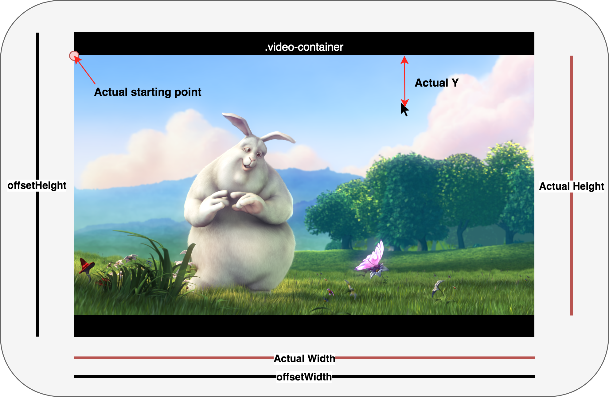

I ran into this problem few weeks ago trying to draw a region on top of a video element streaming WebRTC videos (via Kurento), while being responsive. First of all, we'll have a `<video>` tag, wrapped by `ReactCursorPosition`.

# Setting up the video element
```jsx
constructor(props) {
  super(props);
  this.video = React.createRef();
}
render() {
  <ReactCursorPosition
    className="video-container"
    onPositionChanged={this.onPositionChanged}
  >
    <video autoPlay loop ref={this.video} />
  </ReactCursorPosition>
}
```

With a certain CSS so that the video size is relative to `.video-container`.

```css
.video-container {
  height: 50vh;
}
.video-container video {
  width: 100%;
  height: 100%;
}
```

`ReactCursorPosition` basically works right now, except that the positions is relative to the `.video-container`, meaning if you video has black bars (well, if the `backgroundColor` is black) on the side or top and bottom, it will be included in the position too. I.e. `(0, 0)` is most likely pointing at black dot instead of the top left corner of the actual video. See [this StackOverflow question](https://stackoverflow.com/questions/17056654/getting-the-real-html5-video-width-and-height) or [this](https://stackoverflow.com/questions/40883746/html-video-remove-black-bars) for an idea.

Here's a sketch of the dimensions we need to deal with.



# Get the actual video dimensions in `<video>`
First we need to find the actual rendered size of the video **minus** the black bars (letterboxing or pillarboxing), using the small util function extracted from the answer of the said post.

```js
function getVideoDimensions({
  videoWidth, videoHeight, offsetWidth, offsetHeight,
}) {
  const videoRatio = videoWidth / videoHeight;
  const elementRatio = offsetWidth / offsetHeight;

  const width = elementRatio > videoRatio ? offsetHeight * videoRatio : offsetWidth;
  const height = elementRatio > videoRatio ? offsetWidth / videoRatio : offsetHeight;

  return {
    width,
    height,
  };
}
```

The explanation of the function can be found [here](https://nathanielpaulus.wordpress.com/2016/09/04/finding-the-true-dimensions-of-an-html5-videos-active-area/). *(Do let me know if the website is moved again.)*

# Offsetting the cursor position
Now that we have the actual video dimensions, it's time to get the cursor position! What we want is that `(0, 0)` to be pointing at our video, not the black bars. Let's handle the `onPositionChanged` callback from `ReactCursorPosition`.

```js
onPositionChanged = ({ elementDimensions, position }) => {
  const { height, width } = getVideoDimensions(this.video.current);

  // Get the actual starting point
  // elementDimensions is essentially equals to offsetHeight and offsetWidth
  const realStartPoint = {
    x: (elementDimensions.width - width) / 2,
    y: (elementDimensions.height - height) / 2,
  };

  const { x, y } = position;

  // X & Y measured against the actual starting point.
  const actualX = x - realStartPoint.x;
  const actualY = y - realStartPoint.y;
}
```

Or in simple terms, minus the `(x, y)` by the width or height of the black bar.

# To recap
1. Find the actual video dimensions rendered on the client.
1. Offset the cursor position.

That's all to that! Till next time. *Lots of documentation waiting for me.*
