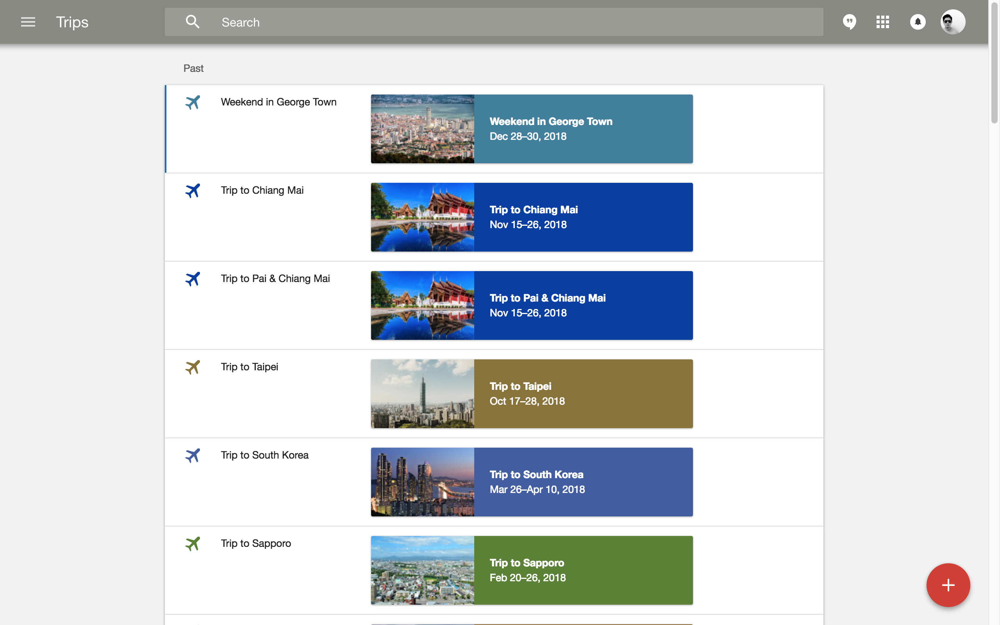
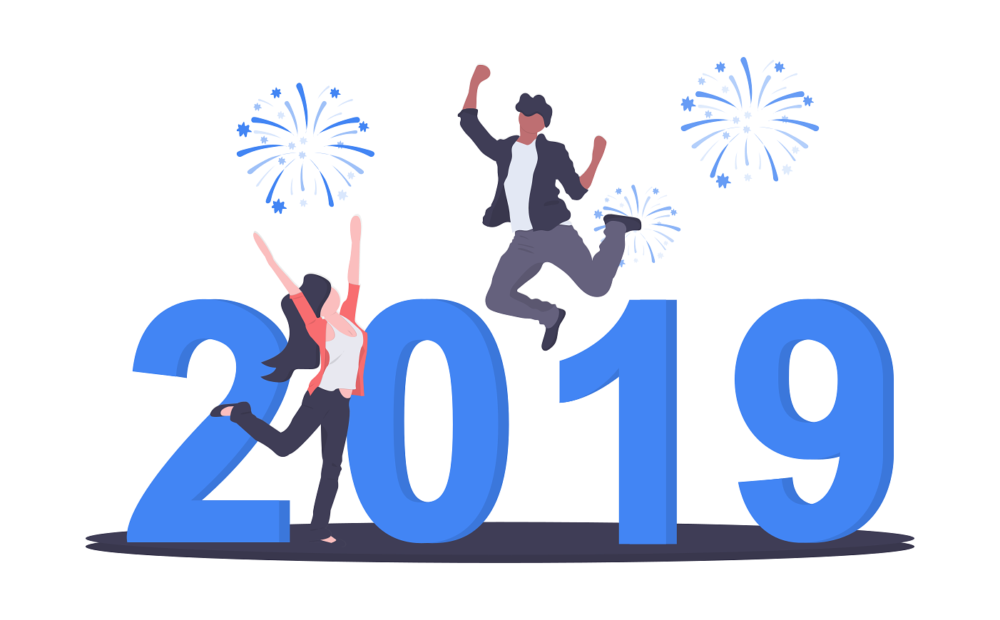

2018 was a year filled with ups and downs, mainly downs, and a real stressful project which I took up multiple roles, and losing some friends (_it's just me, to cut off negative sources from my life, I apologize_).

Despite that, I am happy to have survived through 2018! Thanks to that project, I managed to pick up many skills, which then contribute to blog posts. Most importantly, I met my SO, who has been supportive all year long, pulling me up, putting me in shape countless times. It was her efforts that I didn't fail miserably dealing with all the hardships of 2018. 2019 meant a lot to us, it's the new beginning and turning point of our journey.

I'd also have the opportunity to been to Sapporo, Jeju, Busan, Seoul, Taipei, Hualien, Pai, Chiang Mai (again, for Yee Peng Festival), and ending at Penang with SO.

My 2018 trips, and sad to see Inbox sun-setting in another two months. The Trips bundle is my favorite feature.

Looking back at [my resolutions for 2018](/blog/2018-new-year-resolution), while I have failed many of them, I did manage to pick up something new.

I've...

* **setup** this blog
* **written** 16 posts
* **not** gone diving
* **not** gotten a motorbike license
* **gone** backpacking at least once
* **not** done any certification from AWS
* **tried** to sleep before 12am on most nights, woke at 6am on most days
* **not** found any victim to practice coaching skill
* **read** at least 4 books
* **picked** up a beginner Korean class
* **not** lost any weight, it's been fluctuating

In 2019, I wish to have a financially stable life, while not neglecting personal development. Here goes (while trying to be as SMART as possible)...

* Start writing journals, every day, for 365, using [jrnl](http://jrnl.sh)
* Save up 20% of income, reserve a portion for investment
* Start investing in stock markets, have a multi-industry portfolio
* Own a road bike, pile up at least 1000km by end of year (I don't know how realistic this is)
* Reduce my weight to below 70kg, within 6 months, for health
* Build muscles, look lean, lose the tummy, hit the gym more frequently
* Upgrade blog to Gatsby 2, update theme and fonts, separate tech and misc posts
* Promote to PM/PO roles, less time on coding, more free time on self development and mentoring, more time to code for my dreams
* Spend more time with SO, explore our uncharted territories together
* Spend more time with family

*Illustration thanks to [undraw.co](https://undraw.co)*
