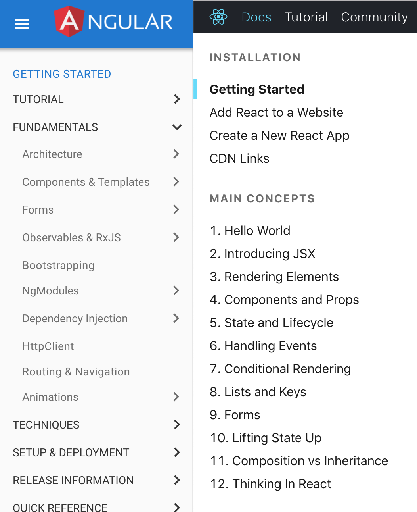
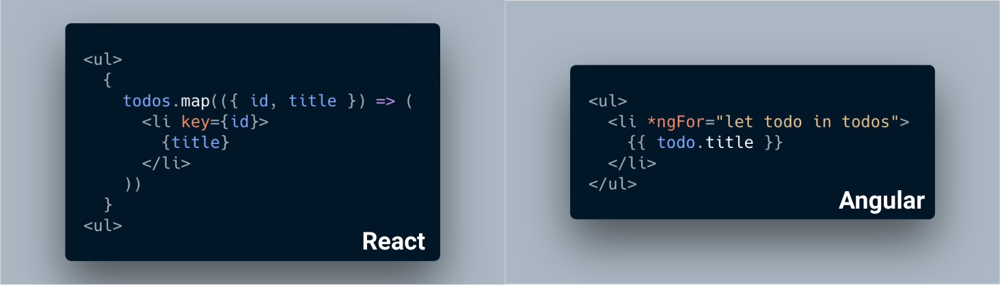

I have the opportunity to develop a webapp using Angular. It wasn't a smooth ride coming from React background. Hence, I'm putting up a short series of React vs Angular, comparing how to achieve the same thing using different JS stack.

The first part of the series, we'll be looking at high level comparison, then on upcoming posts we'll compare how these two technologies on building the same UI.

The usual saying, comparing Angular to React, it's like comparing apple to orange. Okay, apples and oranges aside, let's get things started.

*Note: Angular here refers to Angular 2, not AngularJS*

# Angular: framework; React: UI library
Angular comes with a whole package of tools that you will need for developing a webapp. Tools like routing, HTTP client, observables, testing, dependencies injection, etc.

React is just a library which you can easily include the script in the `<head>` and start using React. Of course, as a *lightweight* library, you don't get many features needed when developing a webapp, you'll find yourself soon needing tools like react-router, redux, react-redux, or rxjs.

Let me pluck a metaphor that I created just right now. Angular is like Malaysia Airlines which the flight ticket includes baggage and meal; React is AirAsia-like, in which you select packages (baggage, meal, seat, insurance) that you need, and each of the package comes with a price (every packages you install comes with a size).

*I wonder if this metaphor has been said before.*

It's worth to note that you can use React in your existing website without changing anything.

# Angular is beginner-friendly, but difficult to master


You may be deceived by the number of fundamental topics both React and Angular have in their website. But hold on, Angular's topics have more drill downs, making it much deeper to master.

If you know JavaScript, you know React. Although some folks complain about the HTML-like JSX syntax, I have no problem picking it up, it's much simpler than Angular's template syntax.

Below shows how React and Angular render a list of todos.



Which syntax do you prefer?

Angular HTML template does look cleaner here, but I prefer React's JSX syntax. Reason being within the curly brackets, everything is just plain old JavaScript. If you already know JavaScript, you know React. And since it's just JavaScript, you can extract the list items rendering from above example to another function.

```jsx
<ul>
  {this.todos.map(this.renderItems)}
</ul>
```

On the other hand, Angular requires you to learn a number of its syntax, you'll learn terms like interpolation, template expression, template statements, binding syntax, just to name a few.

This is how you bind a input value to a div in Angular.

```html
<input #name>
<div>{{ name.value }}</div>
```

Because of its powerful template *language*, some functions are easier to be implemented in Angular than on React, such as rendering date into human-readable code.

```html
{{ todo.date | date }}
```

# TypeScript, JavaScript, ES6, ES7, Babel, Flow 😨
There's a whole bunch of histories with all these *languages*, we'll not drill down into these. All you need to know is that there are tools that will convert all these different languages into the **JavaScript** that your target browser can understand.

Angular comes default with TypeScript, while React, you can basically use any of the combination, but I always go with Babel with latest features and Flow. [create-react-app](https://github.com/facebook/create-react-app) comes with most of the language features that you'll need during development.

Speaking of create-react-app, the default (at least for me) bootstrap generator for a React application, Angular comes with angular-cli, the generator that can ease your life given the number of files an Angular app needs.

If you've been using Flow, TypeScript wouldn't be any issue for you. You can, of course, just type everything as `any`, but that defeats the purpose of TypeScript, being able to type your data to reduce bugs created by assigning wrong data type or typo. Having said that, I found it frustrating to be creating interfaces for every structure that I need, I miss the flexibility of JavaScript. At times, I feel like I'm writing Java (let's not go into that, I hate Java).

# Should you React or Angular?
As usual, I'd recommend to try both, or at least go through their tutorials, and figure out which do you prefer, which you are happier to develop in. At the end of the day, you'll be able to produce the same webapp.

In part 2 of this series, we'll be comparing React and Angular by functionalities, and components, such as how to build a login form, how to do routing, and more to come. Expect more codes to come!
