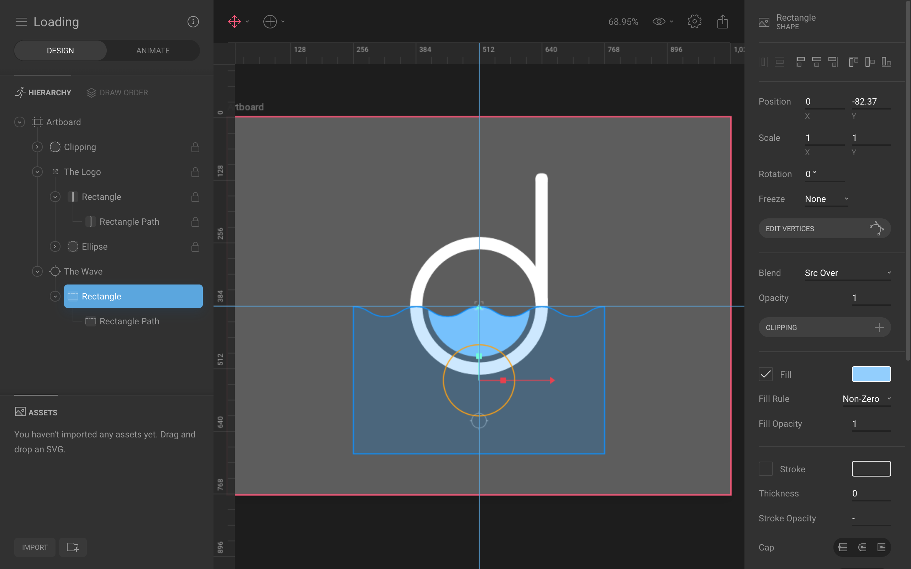

# TODO:

1. Touch on lerpDouble
1. Link to youtube, link youtube back to blog, linktr.ee to blog, insta it

# Inspiration

A week ago I posted an animated Switch widget on my [Instagram][my-insta], built with Flare and Flutter.

`insta: https://www.instagram.com/p/B0iiDXkFqcn/`

I got inspired by a fellow follower to use Flare to build a animated Loading widget. So, challenge accepted, and I proceeded to spend a weekend to build the said animated Loading widget, not without references from other public Flare files.

Here's what we're building, a Loading widget with a looping wave. The height of the wave will be increased depending on the actual "loading calculation".

<div style="text-align: center">


</div>

# Flare by 2Dimensions

If you haven't heard about [Flare][flare], it's a design and animation tool run entirely on your web browser, and it's free for public files! It also comes with a platform to share designs and animations, with the concept of forking, just like GitHub. More importantly, it's super easy to bring the animation into Flutter, which we'll see along this post.

# The Loading widget

The Loading widget is pretty simple, a simple Logo built with combination of an eclipse and a rounded rectangle, and the wave. I've set the wave to be a child of a node so that we can manipulate it in Flutter later on.



If you're interested to the see process of the drawing, I've recorded a 30 minutes video from drawing on Flare to deploying on Flutter below.

`youtube:https://www.youtube.com/embed/SvhPbk2jD9I`

Once you've done the drawing and animation, simply export it as the binary format and it's time for Flutter!

Here's a link to the [Flare project][flare-project].

# Import the animation into Flutter

Importing the animation into Flutter is the same as importing any other assets such as images. Just create an assets folder and dump the .flr file into it.

Inside `pubspec.yaml`, add the following line under `flutter:`

```yaml
  assets:
    - assets/Loading.flr
```

Then add the `flare_flutter` package under `dependencies:`

```yaml
  flare_flutter: ^1.5.5
```

And we're ready to go! The code is pretty short, at 60 LOC. Let me just dump it here 😈

```dart
import 'dart:math';
import 'dart:ui';

import 'package:flare_flutter/flare.dart';
import 'package:flare_flutter/flare_actor.dart';
import 'package:flare_flutter/flare_controls.dart';
import 'package:flutter/material.dart';

void main() => runApp(MaterialApp(home: Loading()));

class Loading extends StatefulWidget {
  @override
  _LoadingState createState() => _LoadingState();
}

class _LoadingState extends State<Loading> {
  LoadingController _controller = LoadingController();

  @override
  Widget build(BuildContext context) {
    return Scaffold(
      floatingActionButton: FloatingActionButton(
        onPressed: () => setState(() => _controller.increment()),
        child: Icon(Icons.add),
      ),
      backgroundColor: Colors.blueGrey,
      body: Container(
        child: Center(
          child: FlareActor(
            'assets/Loading.flr',
            animation: 'Idle',
            controller: _controller,
          ),
        ),
      ),
    );
  }
}

class LoadingController extends FlareControls {
  double _targetY;
  ActorNode _wave;

  @override
  void initialize(FlutterActorArtboard artboard) {
    super.initialize(artboard);
    _wave = artboard.getNode('The Wave');
    _targetY = _wave.y;
    play('idle');
  }

  @override
  bool advance(FlutterActorArtboard artboard, double elapsed) {
    super.advance(artboard, elapsed);
    _wave.y = lerpDouble(_wave.y, _targetY, min(1.0, elapsed * 5.0));
    return true;
  }

  increment() {
    _targetY -= 50.0;
  }
}
```

Let's zoom in the important bits.

## Show animation with FlareActor

First thing first, we load the Flare animation with `FlareActor`, show it where to get the .flr file, which `animation` to run, and set the `controller`.

```dart
FlareActor(
  'assets/Loading.flr',
  animation: 'Idle',
  controller: _controller,
),
```

If you omit the `controller` bit, you basically have a simple animated Loading widet. But we'd like to go one step further by being able to control the wave's height, to fill up the space.

## Control nodes with LoadingController

We create a `LoadingController` which extends `FlareControls` which implements `FlareController`.

That's a mouthful.

Basically, `FlareController` defines an interface to customize the behavior of a Flare animation at runtime. With this, we can control the wave's height (actually its position) while running the idle animation. There are many other [examples on `flare_flutter` repo][flare-flutter-examples] showcasing the capability of `FlareController`

`FlareControls` is a basic implementation of `FlareController` which has already defined all the basic functionality, such as playing an animation, advancing every frame and mixing animations. By extending `FlareControls`, we can concern ourselves with the positioning of the wave.

With that explained, is pretty simple to move the wave's position. First, we get a reference to the wave in the `initialize` method.

```dart
@override
void initialize(FlutterActorArtboard artboard) {
  super.initialize(artboard);
  _wave = artboard.getNode('The Wave');
  _targetY = _wave.y;
  play('idle');
}
```

Then, on every frame, we set the wave's Y position using a simple lerp (linear interpolation) method to smoothen the transition.

```dart
@override
bool advance(FlutterActorArtboard artboard, double elapsed) {
  super.advance(artboard, elapsed);
  _wave.y = lerpDouble(_wave.y, _targetY, min(1.0, elapsed * 5.0));
  return true;
}
```

That's it, now to move the wave, we just need to set `_targetY` to another different number and it will smoothly transition to it.

Here's the result and a time-lapse of the work.

`insta: https://www.instagram.com/p/B0u5PS8Fvpg/`

If you find this helpful, leave a comment below to let me know. Or follow [my Instagram account][my-insta]. Or buy me a coffee at [Patreon][patreon].

[my-insta]: https://instagram.com/yaobin.dev "yaobin.dev on Instagram"
[flare]: https://www.2dimensions.com/about-flare "Flare by 2Dimensions"
[flare-project]: https://www.2dimensions.com/a/yaobin/files/flare/loading/preview "Loading widget built with Flare"
[flare-flutter-examples]: https://github.com/2d-inc/Flare-Flutter/tree/stable/example "Flare Flutter example"
[patreon]: https://www.patreon.com/yaobindev "Buy me a coffee"
